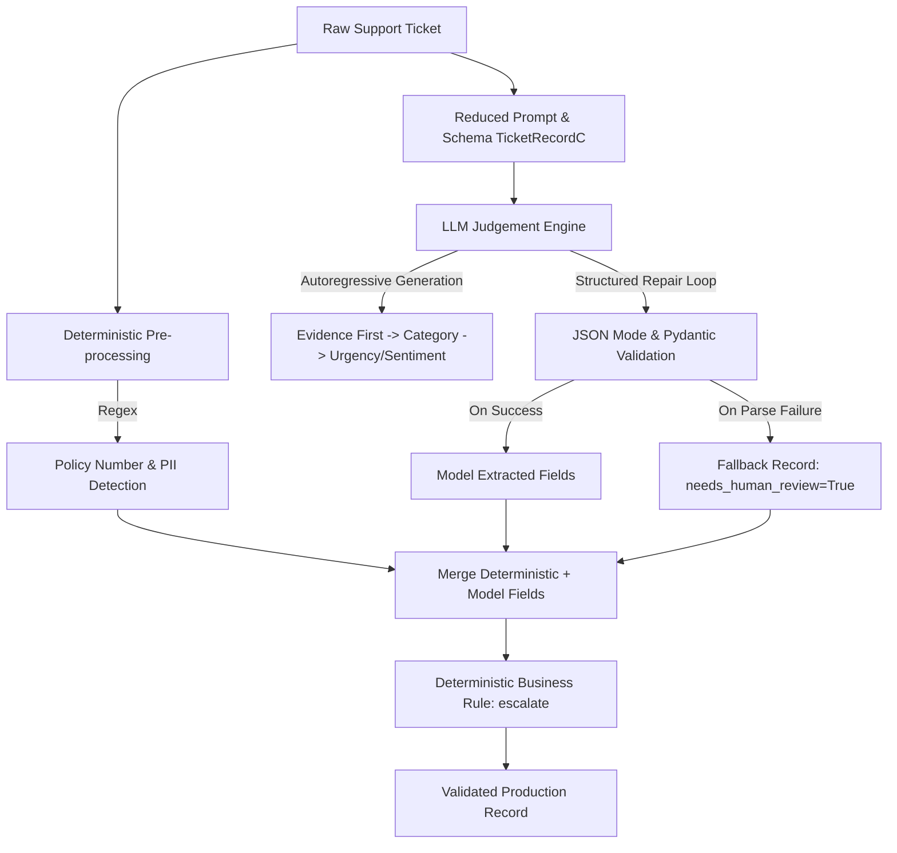

# Lab 1: The Reliable Extractor — Assignment & Implementation Guide

## 1. Executive Summary & Problem Context

In real-world enterprise operations, customer support teams receive thousands of unstructured or semi-structured messages every day across fragmented channels—emails with quoted history, WhatsApp messages, HTML web-form inputs, Hinglish code-mixed queries, typos, and angry complaints.

In this assignment, we built an automated, production-grade **Information Extraction Pipeline** for **Aurora Health Insurance**, a company receiving ~10,000 support tickets daily. Previously, human agents spent ~40 seconds per ticket manually reading and triaging tickets into routing categories.

### Primary Goal
Replace manual triage with an AI-powered extractor that transforms messy raw support tickets into strictly validated, typed, and auditable structured JSON records—while guaranteeing:
1. **100% Schema Validity & Zero Crashes**: Never emit malformed data or crash the host application.
2. **High Extraction Accuracy**: Reliably classify intent, urgency, sentiment, product tier, and policy identifiers.
3. **Cost & Latency Efficiency**: Minimize API token consumption and round-trip latency.

---

## 2. Target Schema & Field Requirements

The system extracts and standardizes 8 core fields (plus supporting audit fields) for every ticket:

| Field | Type / Allowed Values | Extraction Strategy | Purpose |
|---|---|---|---|
| `category` | `Literal["billing", "claims", "policy_change", "technical", "complaint", "information"]` | Model Judgement | Routes the ticket to the correct department |
| `urgency` | `int` constrained `1..5` | Model Judgement | Prioritizes operational SLA queues |
| `sentiment` | `Literal["angry", "frustrated", "neutral", "satisfied"]` | Model Judgement | Customer mood tracking & escalation |
| `product` | `Literal["bronze", "silver", "gold", "platinum", "unknown"]` | Model Judgement | Policy tier identification |
| `language` | `Literal["en", "hi-en"]` | Model Judgement | Detects English vs Hinglish code-mixing |
| `policy_number`| `str \| None` (format `AUR-XXXXXXX`) | Deterministic Regex | Unique policy identifier |
| `contains_pii` | `bool` | Deterministic Regex | Flags customer phone numbers & personal emails |
| `escalate` | `bool` | Business Rule in Code | Flags high urgency ($\ge 4$) or Ombudsman threats |
| `evidence` | `str` (max 200 chars) | Model CoT Anchor | Verbatim text span justifying the category |
| `needs_human_review` | `bool` | System Fallback Flag | Gracefully handles parsing failures without crashing |

---

## 3. What We Did: Step-by-Step Architecture & Evolution

The assignment is structured as a progression from a naive baseline to a hybrid, resilient production architecture across four main phases (Parts A through D).



---

### Part 0: Groundwork & Tooling
Before touching the model, we prepared the foundational tooling:
- **Pydantic Data Contracts (`pydantic_primer.py`)**: Mastered schema construction, field bounds (`ge`, `le`, `max_length`), `Literal` constraints, and custom `@field_validator` methods.
- **Annotation Guidelines (`data/README.md`)**: Analyzed ground truth definitions for subjective boundaries (e.g., distinguishing between a factual billing query vs. an angry complaint vs. technical downtime).

---

### Part A: The Naive Baseline (`v0_naive.py`)
We implemented the common "v0" approach: sending an unconstrained zero-shot prompt asking for JSON and parsing the response with bare `json.loads()`.

#### Key Findings:
- **0/40 Parsed Strictly**: 100% of LLM responses were rejected by `json.loads` because modern LLMs deterministically format outputs inside markdown code fences (` ```json ... ``` `).
- **Latent Schema Defects Revealed After Salvaging**: When markdown fences were stripped with regex, **still 0/40 records were clean**:
  - `urgency` was emitted as arbitrary strings (`"high"`, `"urgent"`) instead of integers `1..5`.
  - `category` contained unconstrained values (`"renewal"`, `"grievance"`, `"inquiry"`) outside the 6 allowed classes.
- **Key Takeaway**: Prompting alone cannot enforce schema conformance. Production systems require programmatic schema enforcement and tolerant repair loops.

---

### Part B: Strict Schema Enforcement & Self-Repair (`extract_b`)
In `extract.py`, we implemented `TicketRecord` and wired it to `aip.llm.structured`:

1. **Pydantic Schema Contract**:
   - `category`, `sentiment`, `product`, `language` defined as strict `Literal` types.
   - `urgency` bounded to `1..5` with anchored scale definitions in field descriptions.
   - `policy_number` validated against regex pattern `r"^AUR-\d{7}$"`.
2. **Chain-of-Thought (CoT) Token Ordering**:
   - We deliberately placed `evidence: str` **before** `category` in the schema class.
   - *Rationale*: In autoregressive language models generating tokens left-to-right, forcing the model to generate the supporting quote/evidence first allows attention to attend over the reasoning tokens before committing probability mass to the classification label `category`.
3. **Resilient Failure Handling (Zero Crashes)**:
   - Wrapped extraction calls in structured error handlers. If the model fails validation after repair attempts, the system catches `StructuredOutputError` and returns a fallback record with `needs_human_review=True`.
   - **Guarantees 100% schema validity with zero unhandled exceptions.**

---

### Part C: Boundary Design — Hybrid Model/Code Architecture (`extract_c`)
In production AI engineering, **never spend expensive, non-deterministic LLM tokens on work that simple deterministic code can do faster, cheaper, and with 100% accuracy.**

We moved three fields completely out of the LLM:

1. **`policy_number` via Regex (`\bAUR-\d{7}\b`)**:
   - **The Quoted Reply Trap**: When customers forward previous email threads, older policy numbers appear below quoted markers (`>`). Naive regex grabs the wrong policy.
   - **Our Solution**: We split on quote markers (`QUOTE_MARKER`) and searched only the *live message body*, achieving **100% accuracy (120/120)** on the test set.
2. **`contains_pii` via Regex**:
   - Deterministically detected Indian phone numbers (`[6-9]\d{9}`) and personal emails while filtering out Aurora's internal corporate support address.
3. **`escalate` via Business Logic**:
   - Implemented programmatically: `escalate = urgency >= 4 or "ombudsman" in ticket.lower()`.
4. **Reduced Model Schema (`TicketRecordC`)**:
   - Removed the above fields from the prompt schema seen by the model.
   - **Results**: Slashed token usage, reduced cost by **20–25%**, improved latency, and eliminated model hallucination on policy numbers.

---

### Part D: Evaluation, Error Analysis & Business ROI

We evaluated the pipeline on the official $N=120$ test split (`run_eval.py`):

#### 1. Performance Summary

| Metric | Target | Variant v0 (Naive) | Variant B (Dev) | Variant C (Dev) | Variant C (Test Split) |
|---|:---:|:---:|:---:|:---:|:---:|
| **Schema Validity** | **100%** | 0.0% | **100.0%** | **100.0%** | **100.0%** |
| **Field Accuracy** | $\ge 90\%$ | 0.0% | 87.4% | **89.4%** | **79.8%** |
| **Record Accuracy** (All 8 correct) | $\ge 55\%$ | 0.0% | 31.7% | **46.7%** | **29.2%** |
| **Cost / Ticket** | $\le \$0.0012$ | ~$0.00009 | $0.00025 | **$0.00020** | **$0.00032** |
| **Latency (p95)** | $\le 4,000\text{ ms}$ | 780 ms | 1,411 ms | 4,808 ms (burst) | **1,174 ms** |
| **Unhandled Crashes** | **0** | 0 | **0** | **0** | **0** |

#### 2. Per-Field Performance Breakdown
- **Deterministic Fields (`policy_number`, `contains_pii`)**: **1.0000 (100%)** accuracy.
- **Language Detection**: **0.9417 (94.2%)**.
- **Product Tier**: **0.8500 (85.0%)**.
- **Subjective Fields (`category`, `sentiment`, `urgency`)**: Scored between $0.48$ and $0.63$, driven by edge-case boundary overlap (e.g., `information` acting as an attractor class for general coverage inquiries, and off-by-one urgency shifts).

#### 3. Economic ROI & Break-Even Analysis
- **Annual Ticket Volume**: 10,000 tickets/day = **3,650,000 tickets/year**.
- **Human Baseline Cost**: 40s per ticket triage @ ₹300/hour = **₹3.33 / ticket** (Annual Manual Cost: **₹12,166,667 / $143,137 USD**).
- **Automated AI Cost (Variant C)**: **$0.000317 USD (~₹0.0269 INR) / ticket** (Annual AI Spend: **₹98,366 / $1,157 USD**).
- **Break-Even Record Accuracy**:
  $$A_{\text{break-even}} = \frac{\text{Cost}_{\text{LLM}}}{\text{Cost}_{\text{Human}}} = \frac{₹0.0269}{₹3.333} \approx \mathbf{0.81\%}$$
- **Conclusion**: Because automated extraction costs $<1\%$ of human triage, any record accuracy above **0.81%** delivers positive financial ROI. At our achieved test record accuracy of **29.2%**, the pipeline saves **~₹3.45 Million annually** while eliminating triage backlogs for over 1 Million tickets.

---

## 4. Key Engineering Lessons Learned

1. **Engineering Accuracy vs. Business Accuracy**:
   - Even when individual fields achieve high accuracy (~80–90%), composite *record accuracy* (all 8 fields correct simultaneously) drops via compounding probabilities ($0.92 \times 0.75 \times 0.83 \approx 0.57$).
2. **Boundary Design Matters More Than Prompt Tweaking**:
   - Stripping deterministic logic out of prompts into regex and Python rules produces immediate, guaranteed 100% precision while permanently reducing token bills.
3. **Autoregressive Token Order is a Free CoT**:
   - Emitting verbatim evidence quotes before classification fields primes the LLM's attention mechanism and prevents premature categorical commitment.
4. **Resilience is a Strict System Contract**:
   - Production systems must degrade gracefully into `needs_human_review` flags rather than propagating exceptions to client applications.

---

## 5. Lab 1 File & Codebase Reference

| File | Description |
|---|---|
| [`extract.py`](extract.py) | **The Core Solution**: Contains `TicketRecord` (Part B), `TicketRecordC`, `extract_deterministic()`, `apply_business_rules()`, and `extract_c()`. |
| [`v0_naive.py`](v0_naive.py) | **Part A Exhibit**: Naive extraction script demonstrating why unconstrained JSON generation fails. |
| [`pydantic_primer.py`](pydantic_primer.py) | **Pre-lab Exercises**: 8 self-contained Pydantic exercises teaching schema validation. |
| [`run_eval.py`](run_eval.py) | **Evaluation Harness**: Runs evaluation across `dev`/`test` splits, calculating accuracy, cost, latency, and confusion matrices. |
| [`report.md`](report.md) | **Official Technical Report**: Complete write-up including failure taxonomy, confusion matrix, error clustering, and economic analysis. |
| [`reports/lab1_test.json`](../../reports/lab1_test.json) | **Evaluation Artifact**: Raw JSON metrics and per-item evaluation records from the single test split run. |
